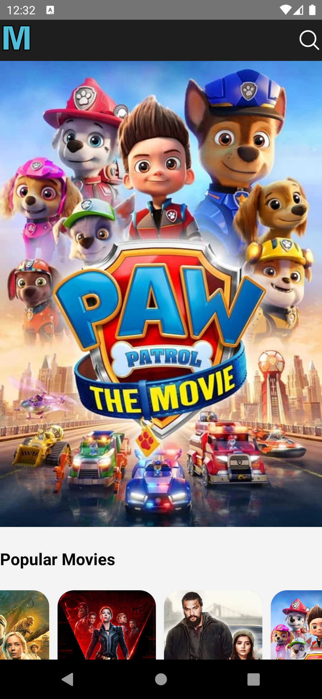
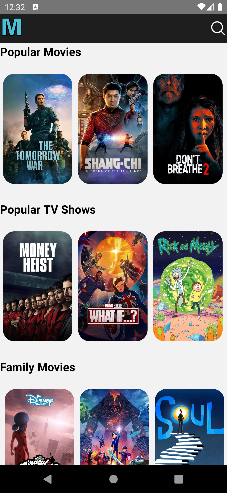
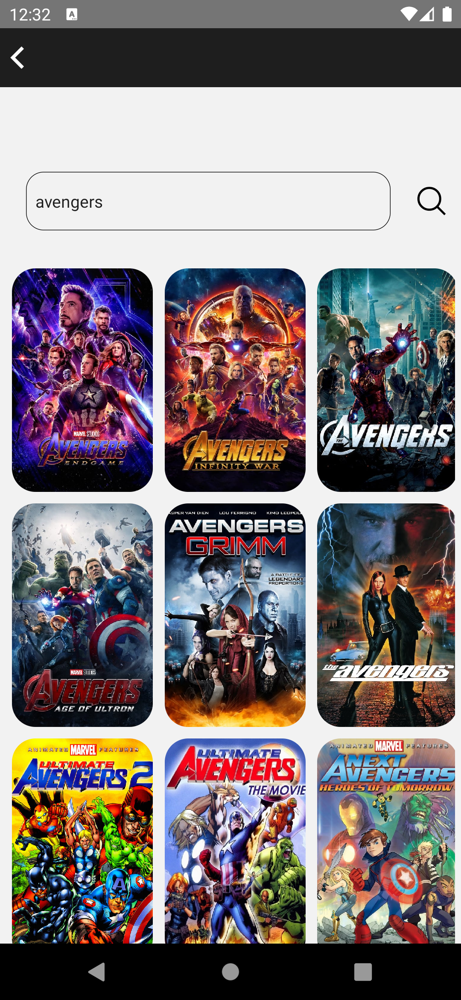

# React Native Movie App

In this React Native app i have used react-native-cli. It's a simple app which uses themoviedb api to show the movie data. Anyone who are beginner to React Native i think this project will help them to understand React Native.

## Getting Started

These instructions will get you a copy of the project up and running on your local machine for development and testing purposes.

## Installing

```bash
# first clone the repository on your local machine.
git clone https://github.com/devmahmud/BleProject.git

# i have used yarn as a package manager for node. you can use npm

# To install the dependency:
yarn install

# To start the project:
yarn start

# To Run the project on Android Emulator or Externel Android Device:
yarn android

# To Run the project on IOS Emulator:
cd ios && pod install
yarn ios
```

## Requirements

To setting up the development environment you can follow the guide:
[RN Developement Environment Setup](https://reactnative.dev/docs/environment-setup)

## App Screenshots

<table>
  <tr>
    <td></td>
    <td></td>
  </tr>
  <tr>
    <td></td>
    <td></td>
  </tr>
 </table>

## Author

> Fadi Nouh, Tiago Pereira